# Testing markdown file (linked in README)

# Lighthouse 


## Mobile
## Performance

## Desktop
## Performance


# ShutterSpace Python Testing
## settings.py

## urls.py
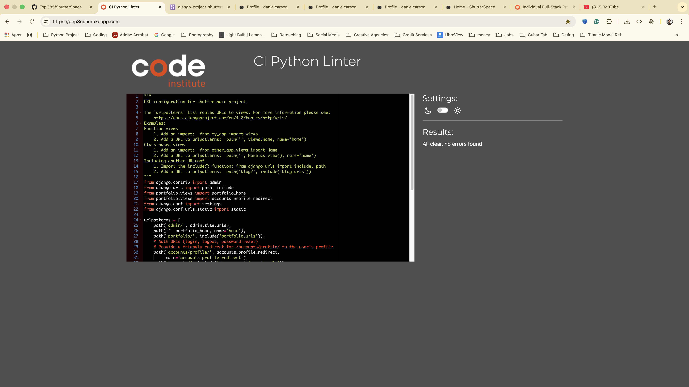


# Portfolio Python Testing
## views.py

## models.py
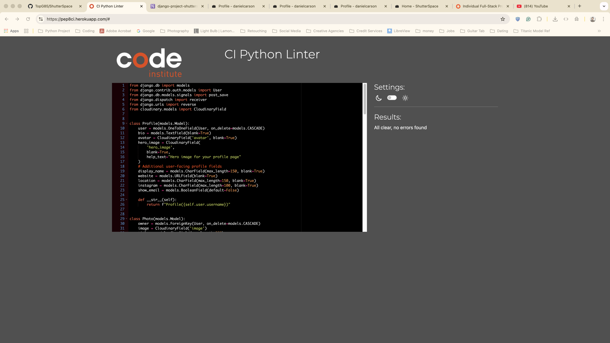
## apps.py
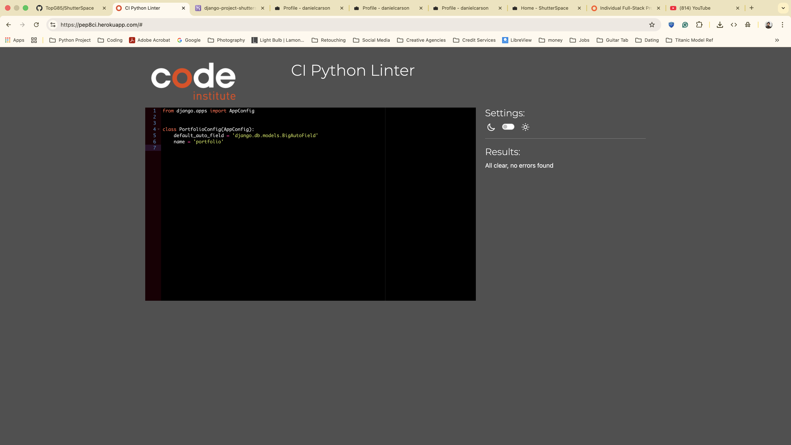
## forms.py
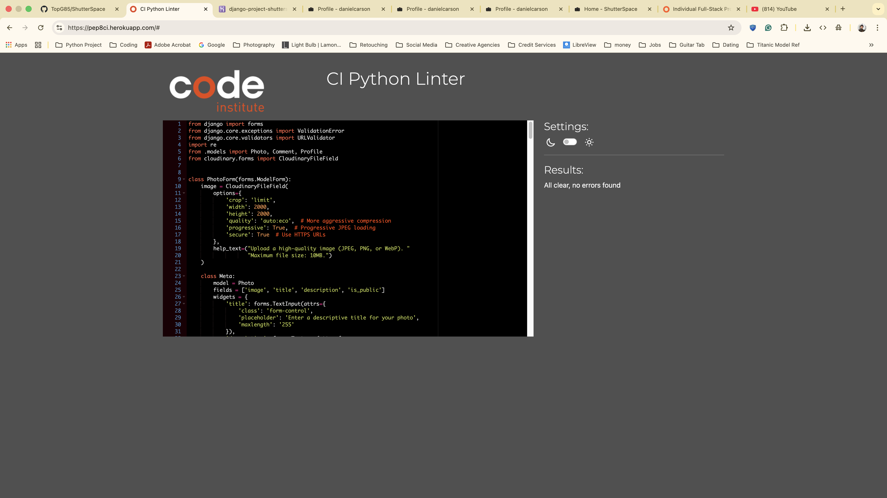
## admin.py
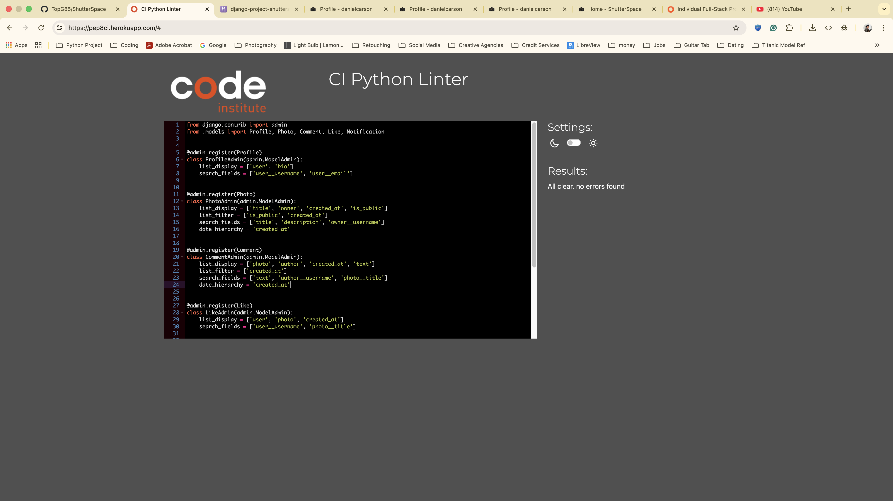


# Migrations
## initial.py

## like.py
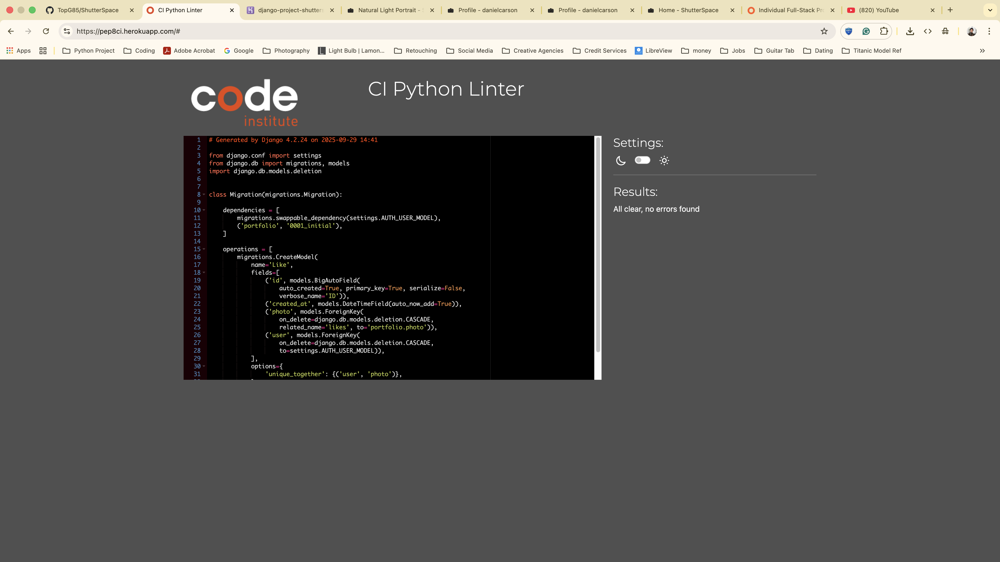
## profile_display_name_profile_instagram_and_more.py 
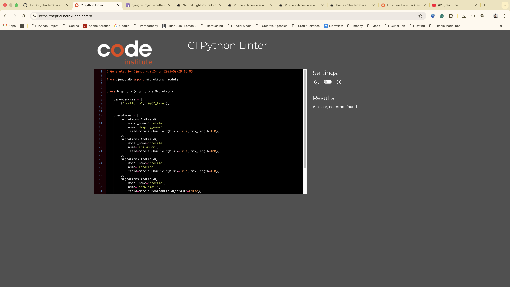
## alter_photo_image_alter_profile_avatar.py
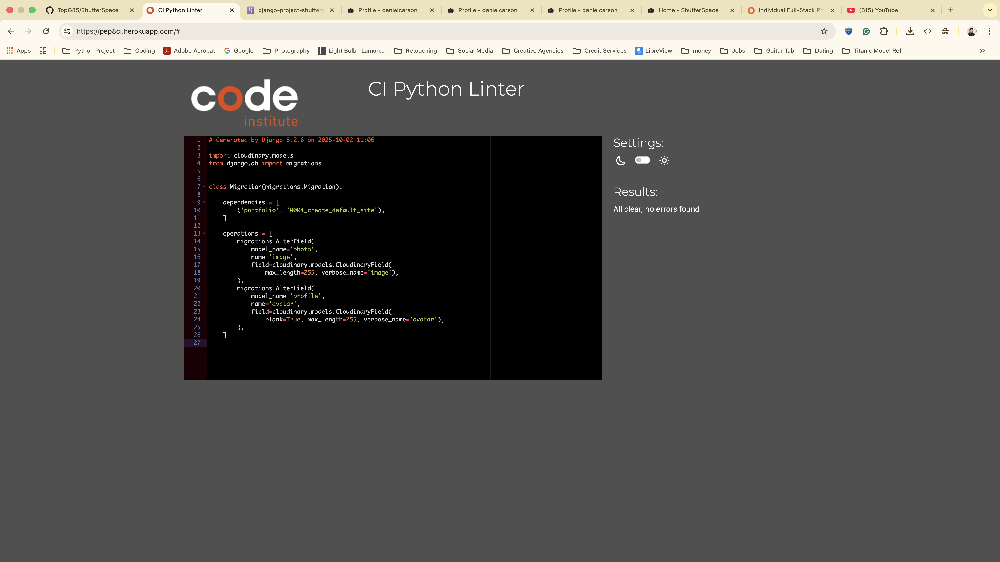
## profile_hero_image.py
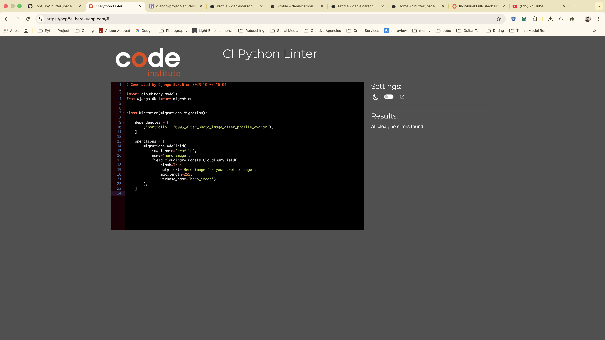
## notification.py
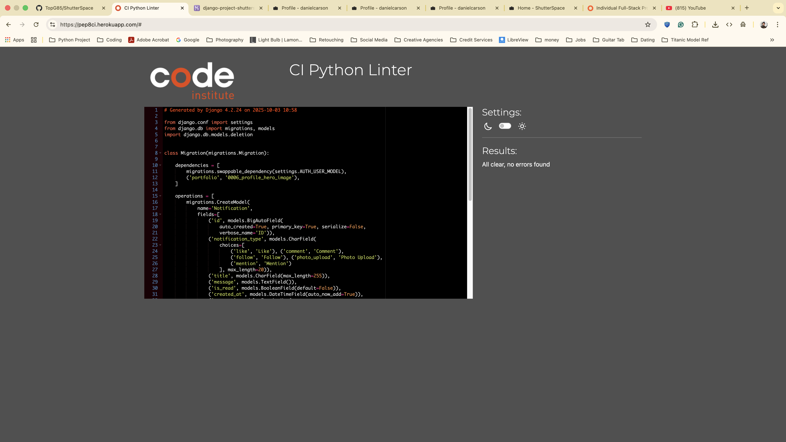

# HTML & CSS Validation

## test HTML Markup Validation 
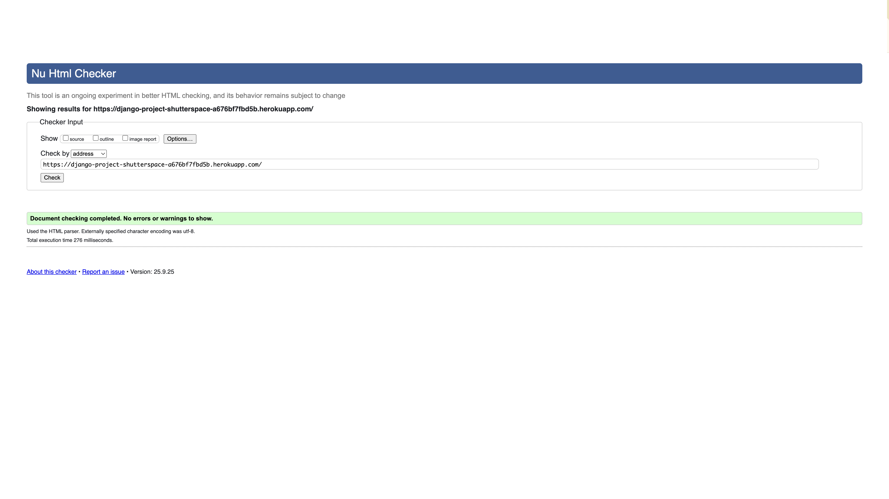

## test CSS Vailidation
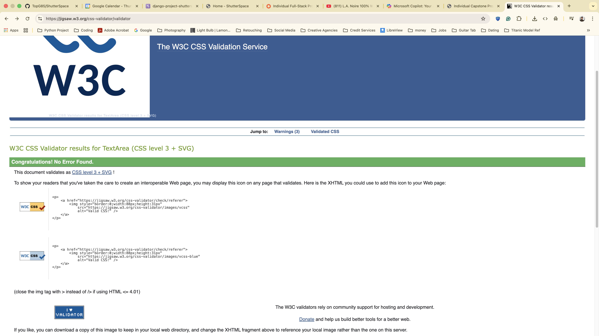

## W3C CSS validation notes

When running the W3C CSS validator against the deployed site there are a number of warnings that are expected and safe to ignore. These are caused primarily by third-party vendor code and modern CSS features that the static validator flags but which are required for cross-browser support.

Summary of common warnings you may see:

- Vendor-prefixed properties (example: `-webkit-`, `-moz-`): used by Bootstrap and Font Awesome for browser compatibility. These are intentional and should be left unchanged.
- CSS custom properties (variables): the validator reports that these are dynamically evaluated and cannot be fully statically checked — this is informational only.
- `rotate(var(--fa-rotate-angle, none))`: reported by the validator when using the CDN Font Awesome file. To pass validation we host a local copy and replace the fallback `none` with `0deg` (e.g. `rotate(var(--fa-rotate-angle, 0deg))`). This repository includes a local `static/css/all.min.css` with that change.
- Deprecated properties (example: `clip`) may appear in third-party libraries; they are safe to ignore when they originate from Bootstrap or Font Awesome.
- Other vendor-only pseudo-elements/classes (e.g., `::-webkit-...`, `:-moz-...`) are safe to ignore.

Practical guidance:

1. The only warnings you should consider changing are ones coming from our own CSS (`static/css/style.css`). Examples we fixed in this project:
	 - Replaced `pointer-events: auto` (which some validators flag) with `pointer-events: initial` in inline styles to silence the validator.
	 - Made explicit background/border color choices to avoid "same color" warnings for buttons in `#deleteCommentModal`.

2. Font Awesome icons missing? If icons are not visible, ensure the `webfonts/` folder is present under `static/` and contains the `.woff2`/`.woff` files that `all.min.css` expects. Example layout:

```
static/
	css/
		all.min.css
	webfonts/
		fa-solid-900.woff2
		fa-regular-400.woff2
		fa-brands-400.woff2
		...
```

3. To install the webfonts locally (macOS / zsh), from the project root run the provided helper script `scripts/install_fontawesome.sh` which downloads Font Awesome v6.4.2, copies the `webfonts/` files into `static/webfonts/`, installs the vendor `all.min.css`, reapplies the `rotate()` fallback fix, and optionally runs `collectstatic`.

4. After copying fonts or updating CSS, hard-refresh your browser (Cmd+Shift+R) to avoid cached resources. For deployed sites, run `python manage.py collectstatic` and redeploy.

5. If you want zero W3C validator warnings, host local copies of third-party CSS and (optionally) edit them for strict conformance — but be aware that editing vendor files may need re-application after upgrades.

If you want, I can open a Pull Request with `static/webfonts/` and `static/css/all.min.css` added once you run the install script locally and commit the changes; or I can prepare a minimal PR that includes the `TESTING.md` additions and instructions only.
