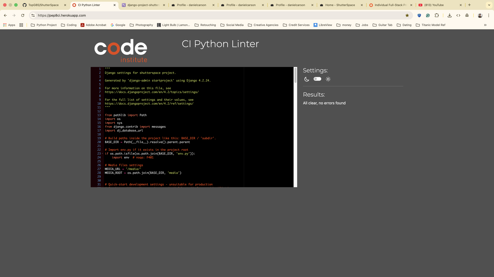

# Testing markdown file (linked in README)

# Lighthouse 

## Mobile
## Performance

## Desktop
## Performance

# ShutterSpace Python Testing
## settings.py

## urls.py

# Portfolio Python Testing
## views.py

## models.py

## apps.py

## forms.py

## admin.py

# Migrations
## initial.py

## like.py

## profile_display_name_profile_instagram_and_more.py 

## alter_photo_image_alter_profile_avatar.py

## profile_hero_image.py

## notification.py

# HTML & CSS Validation

## test HTML Markup Validation 

## test CSS Vailidation

