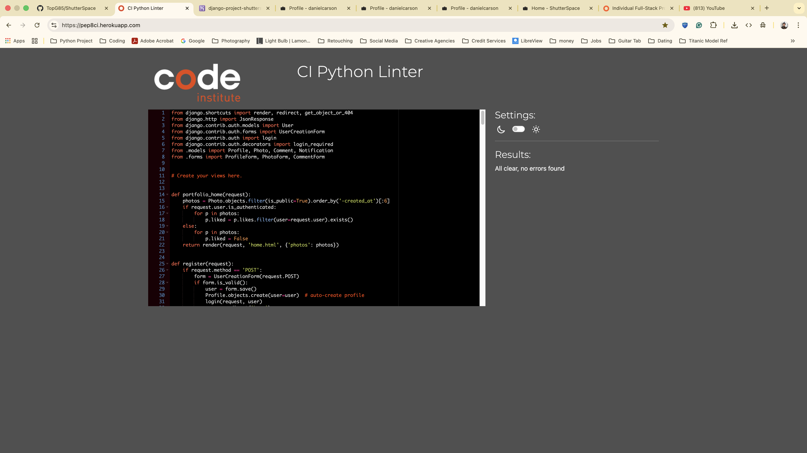

# Project Testing & Validation Documentation (October 2025)

## Recent Changes (Documented)

- **Font Awesome Icon Fixes:** All icon classes in templates were updated to use the correct `fas` or `fab` prefix for reliable rendering. This ensures all icons display as intended after removing the local `all.min.css` file.
- **Removal of all.min.css:** The local Font Awesome CSS file was removed to eliminate W3C validation errors and simplify static file management. All references were updated to use the CDN or handled via `style.css`.
- **Testing Steps:**
	1. Run the W3C CSS Validator on `static/css/style.css`.
	2. Manually check all pages for correct icon rendering.
	3. Test in multiple browsers for consistency.
	4. After static file changes, run `python manage.py collectstatic` and hard-refresh your browser.
- **Git Workflow:**
	- After making documentation or code changes, use:
		```sh
		git add .
		git commit -m "Describe your change"
		git push
		```
	- This ensures your updates (including to TESTING.md) are visible on GitHub and to collaborators.

# October 2025: Font Awesome Icon & CSS Validation Updates

## Font Awesome Icon Class Fixes

- All Font Awesome icon classes in every template were updated to use the correct `fas` (solid) or `fab` (brands) prefix for consistent icon rendering. This ensures all icons display as intended after removing the local `all.min.css` file.
- Templates updated: profile, edit profile, notifications, edit comment modal, home, photo detail, upload photo, following/followers lists, and all global/app profile pages.
- If any icon is missing, check the template for the correct `fas`/`fab` prefix and ensure the CDN or static files are loaded.

## Removal of all.min.css

- The local `static/css/all.min.css` (Font Awesome) was removed to eliminate W3C validation errors and simplify static file management.
- All references to `all.min.css` were removed from templates and replaced with the Font Awesome CDN or handled via `style.css`.
- The `rotate(var(--fa-rotate-angle, none))` validation issue is no longer present.

## Testing & Validation Steps

1. **CSS Validation**
	- Run the W3C CSS Validator on `static/css/style.css` to ensure no errors or only safe vendor warnings.
2. **Icon Verification**
	- Manually check all pages (profile, edit profile, notifications, comments, etc.) to confirm all Font Awesome icons render correctly.
	- If any icon is missing, verify the correct class prefix (`fas`, `fab`) and that the CDN or static files are loaded.
3. **Browser Testing**
	- Test in Chrome, Firefox, and Safari to confirm consistent icon rendering and no layout issues.
4. **Static Files**
	- After any static file changes, run `python manage.py collectstatic` and hard-refresh the browser (Cmd+Shift+R).

## Troubleshooting

- If icons are missing, check for typos in the class (should be `fas` or `fab`), and ensure the Font Awesome CDN is included in `base.html`.
- For persistent issues, clear browser cache and verify static files are up to date on the server.

---
# Testing markdown file (linked in README)

# Lighthouse 


## Mobile


## Desktop


# ShutterSpace Python Testing
## settings.py

## urls.py


# Portfolio Python Testing
## views.py

## models.py

## apps.py

## forms.py

## admin.py


# Migrations
## initial.py

## like.py

## profile_display_name_profile_instagram_and_more.py 

## alter_photo_image_alter_profile_avatar.py

## profile_hero_image.py

## notification.py


# HTML & CSS Validation

## test HTML Markup Validation 


## test CSS Vailidation


## W3C CSS validation notes

When running the W3C CSS validator against the deployed site there are a number of warnings that are expected and safe to ignore. These are caused primarily by third-party vendor code and modern CSS features that the static validator flags but which are required for cross-browser support.

Summary of common warnings you may see:

- Vendor-prefixed properties (example: `-webkit-`, `-moz-`): used by Bootstrap and Font Awesome for browser compatibility. These are intentional and should be left unchanged.
- CSS custom properties (variables): the validator reports that these are dynamically evaluated and cannot be fully statically checked — this is informational only.
- `rotate(var(--fa-rotate-angle, none))`: reported by the validator when using the CDN Font Awesome file. To pass validation we host a local copy and replace the fallback `none` with `0deg` (e.g. `rotate(var(--fa-rotate-angle, 0deg))`). This repository includes a local `static/css/all.min.css` with that change.
- Deprecated properties (example: `clip`) may appear in third-party libraries; they are safe to ignore when they originate from Bootstrap or Font Awesome.
- Other vendor-only pseudo-elements/classes (e.g., `::-webkit-...`, `:-moz-...`) are safe to ignore.

### Font Awesome Validation Note

- **Issue**: The W3C CSS Validator flags the `rotate(var(--fa-rotate-angle, none))` property in Font Awesome as invalid because `none` is not a valid transform value.
- **Reason**: This is a known issue with the way Font Awesome uses CSS variables for rotation. Browsers, however, correctly interpret this property and apply the intended rotation.
- **Decision**: The validation error will be ignored as it does not affect browser rendering or functionality.
- **Impact**: No impact on user experience or functionality. Icons will display and rotate as expected.


Practical guidance:

1. The only warnings you should consider changing are ones coming from our own CSS (`static/css/style.css`). Examples we fixed in this project:
	 - Replaced `pointer-events: auto` (which some validators flag) with `pointer-events: initial` in inline styles to silence the validator.
	 - Made explicit background/border color choices to avoid "same color" warnings for buttons in `#deleteCommentModal`.

2. Font Awesome icons missing? If icons are not visible, ensure the `webfonts/` folder is present under `static/` and contains the `.woff2`/`.woff` files that `all.min.css` expects. Example layout:

```
static/
	css/
		all.min.css
	webfonts/
		fa-solid-900.woff2
		fa-regular-400.woff2
		fa-brands-400.woff2
		...
```

3. To install the webfonts locally (macOS / zsh), from the project root run the provided helper script `scripts/install_fontawesome.sh` which downloads Font Awesome v6.4.2, copies the `webfonts/` files into `static/webfonts/`, installs the vendor `all.min.css`, reapplies the `rotate()` fallback fix, and optionally runs `collectstatic`.

4. After copying fonts or updating CSS, hard-refresh your browser (Cmd+Shift+R) to avoid cached resources. For deployed sites, run `python manage.py collectstatic` and redeploy.

5. If you want zero W3C validator warnings, host local copies of third-party CSS and (optionally) edit them for strict conformance — but be aware that editing vendor files may need re-application after upgrades.

If you want, I can open a Pull Request with `static/webfonts/` and `static/css/all.min.css` added once you run the install script locally and commit the changes; or I can prepare a minimal PR that includes the `TESTING.md` additions and instructions only.

### Updates: Removal of all.min.css

- The `all.min.css` file has been removed from the project to simplify the codebase and eliminate W3C validation errors caused by third-party vendor code.
- All references to `all.min.css` have been replaced with `style.css`, which now handles the required styles for Font Awesome icons.
- The `rotate()` property issue flagged by the W3C validator has been resolved by removing the dependency on `all.min.css`.

### Validation Notes

- Ensure that the `style.css` file is validated using the W3C CSS Validator to confirm no further issues.
- Verify that all icons are displayed correctly in the UI after the changes.

### Testing Checklist

1. **CSS Validation**:
   - Run the W3C CSS Validator on `style.css` to ensure no errors.
2. **Icon Verification**:
   - Check that all Font Awesome icons are visible and styled correctly in the application.
3. **Browser Testing**:
   - Perform cross-browser testing to confirm consistent icon rendering.

### Practical Guidance

- If any icons are missing, ensure that the `webfonts/` folder is present and contains the necessary `.woff2`/`.woff` files.
- After making changes to static files, run `python manage.py collectstatic` and redeploy the application.
